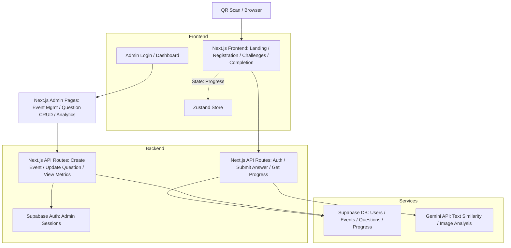

# Implementation Plan: Scavenger Hunt App

## Overview

This plan outlines the technical implementation for the Scavenger Hunt App based on the finalized specification in `spec.md`. The app supports a user-facing web application for participants to register, complete randomized challenges via text, multiple choice, or image submissions with AI validation, and view a completion screen. An admin interface enables event and question management, progress monitoring, and analytics. All data persists in a database, with questions randomized per user on first load and order preserved. The event targets October 14, 2025. The plan ensures alignment with all functional requirements (FR-001 to FR-012), user stories, key entities, and success criteria, without introducing new features. High-level effort estimate: 4-6 weeks for MVP, assuming a small team.

## Tech Stack

- **Frontend**: Next.js 14+ (App Router) with React 18 for server-side rendering and dynamic pages. Tailwind CSS for responsive, accessible UI styling. Zustand for lightweight state management of user progress and session data.
- **Backend**: Next.js API routes for handling user submissions, AI integration, and admin operations. Node.js runtime for serverless deployment.
- **Database**: Supabase (PostgreSQL-based) for persistent storage of users, events, questions, answers, and progress. Supports real-time subscriptions for admin updates if needed.
- **AI Integration**: Google Gemini API (via `@google/generative-ai` SDK) for text similarity scoring (0-10 scale) and image analysis. Threshold configurable per question (default 8/10 for correctness).
- **Authentication**: NextAuth.js for admin login (single role, e.g., credentials provider with hardcoded or env-based secret). User persistence via session cookies or Supabase auth (name-based unique ID).
- **Other Tools/Libraries**:
  - `canvas-confetti` for completion screen effects.
  - `react-dropzone` for image uploads.
  - `zod` for schema validation on forms and API payloads.
  - QR code generation external (e.g., via online tool linking to `/`); no in-app generation needed.
- **Deployment**: Vercel for Next.js hosting; Supabase for DB. Environment variables for API keys (Gemini, Supabase).

This stack leverages the project's Next.js/React context, ensures scalability for 1000 users (SC-004), and focuses on simplicity for rapid development.

## Architecture Diagram

The architecture follows a monolithic Next.js structure with API routes for backend logic, separated into user and admin paths. Data flows from frontend to API to database/AI services.

- **User Flow**: QR → Landing → Register → Challenges (randomized) → Submit (AI if text/image) → Progress Update → Completion (confetti).
- **Admin Flow**: Login → Dashboard (metrics) → CRUD Events/Questions → View Progress/Winners.
- **Data Layer**: Relational schema with foreign keys (e.g., Progress links User to Question).

## Component Breakdown

Requirements map to modular components/pages in Next.js structure (`app/` directory for routing).

### User Flow Components
- **Landing Page** (`/`) [FR-001]: Instructions and start button. Redirects to registration if not started.
- **Registration Form** (`/register`) [FR-002]: Input for first/last name, generates unique ID, initializes progress in DB, redirects to challenges. Persists via session.
- **Challenges List** (`/challenges`) [FR-003]: Displays questions in persisted random order with progress bar (e.g., completed/total). List items link to detail.
- **Challenge Detail** (`/challenge/[id]`) [FR-004, FR-005]: Renders based on type:
  - Text: Input field, submit to AI for similarity score; retry loop with feedback until >= threshold.
  - Multiple Choice: Radio buttons for options, exact match validation.
  - Image: Upload component, AI analysis for correctness.
  Updates progress on success.
- **Completion Screen** (`/completion`) [FR-006, FR-011]: Confetti animation, congratulations message, manual prize instructions (e.g., "Contact organizer at event").

### Admin Components
- **Admin Dashboard** (`/admin`) [FR-010, FR-012]: Auth guard; overview of metrics (engagement, completions), winners list, logs.
- **Event Management** (`/admin/events`) [FR-008, FR-009]: CRUD for ScavengerHuntEvent (title, description, date default Oct 14, 2025). Form with question embedding.
- **Question Management** (`/admin/questions/[eventId]`) [FR-008, FR-009]: CRUD for Questions (type, content, answer, closeness scale for text). Supports adding multiple answers for MC.
- **Progress Viewer** (`/admin/progress`) [FR-010]: Table of user progress, filter by event, export stats.

### Shared Modules
- **Auth Guard**: HOC or middleware for admin routes.
- **API Utilities**: Hooks/services for DB queries (e.g., `useProgress`), AI calls (e.g., `analyzeText`).
- **Types/Schemas**: Zod for validation, TypeScript interfaces for entities (User, Event, Question, Progress).
- **UI Components**: Reusable like ProgressBar, ChallengeCard, FeedbackMessage.

## Development Phases

Phased approach with markdown checklists for tasks. Each phase builds incrementally, testable via Storybook or manual flows. Total subtasks: ~40, prioritized by user stories (P1 first).

### Phase 1: Project Setup and Database (1 week)
- [ ] Initialize Next.js project with TypeScript, Tailwind, Zustand, NextAuth, Zod.
- [ ] Set up Supabase project; define schema for entities (Users, ScavengerHuntEvents, Questions, Answers, Progress) with relationships and indexes (e.g., unique user-event progress).
- [ ] Configure environment variables (Gemini API key, Supabase URL/key).
- [ ] Implement basic API routes for DB connection testing (e.g., health check).
- [ ] Seed initial event data (Oct 14, 2025 hunt with sample questions).

### Phase 2: User Authentication and Persistence (1 week)
- [ ] Build registration form and session management (name → unique ID, store in Supabase).
- [ ] Implement user progress initialization (randomize question order on first load, persist array).
- [ ] Add API routes for getting/updating user progress.
- [ ] Test persistence: Simulate sessions, verify data retention.

### Phase 3: User Challenge Flow (1-2 weeks)
- [ ] Create challenges list page with progress bar and randomization logic.
- [ ] Develop challenge detail components for each type (text, MC, image).
- [ ] Integrate Gemini API: `analyzeText` for similarity (cosine or semantic score → 0-10), `analyzeImage` for validation.
- [ ] Add submission logic: Retry for text until threshold, update progress on success.
- [ ] Build completion screen with confetti and instructions.
- [ ] Ensure accessibility (ARIA labels, keyboard nav) and responsive design.

### Phase 4: Admin Interface (1 week)
- [ ] Set up admin auth with NextAuth (login form, single role).
- [ ] Implement dashboard with metrics queries (completion rates, engagement stats via SQL aggregates).
- [ ] Build CRUD pages for events and questions (forms with type-specific fields, closeness scale).
- [ ] Add progress viewer with tables and filters.
- [ ] Secure API routes with admin middleware.

### Phase 5: Integration, Testing, and Polish (0.5-1 week)
- [ ] End-to-end testing: User flows (registration to completion), admin CRUD, AI validation (mock for unit tests).
- [ ] Handle edge cases: Invalid uploads, partial progress, duplicate names (use UUID).
- [ ] Performance: Optimize API calls, add loading states.
- [ ] Validate success criteria (e.g., load tests for 1000 users via tools like Artillery).
- [ ] Documentation: Update README with setup, QR usage.

## Risks and Mitigations

- **Assumptions**: Gemini API key provided; app web-based (no native mobile); user persistence via name (no email); image analysis uses simple Gemini prompts (e.g., "Does this match [description]? Score 0-10").
- **Risks**:
  - AI Accuracy (SC-002): Variable similarity scoring may frustrate users. Mitigation: Admin-set thresholds, unlimited retries, fallback manual review in admin logs; test with diverse inputs.
  - Data Privacy: Storing names/images. Mitigation: GDPR-compliant (anonymize IDs), Supabase row-level security; no PII beyond names.
  - Scalability (SC-004): High concurrency. Mitigation: Serverless on Vercel, Supabase connection pooling; monitor API rate limits.
  - Dependencies: Gemini downtime. Mitigation: Fallback to exact match for text, offline mode for progress.
  - Effort Overrun: Complex AI integration. Mitigation: Phase gates with prototypes (e.g., Phase 3 AI POC).
- **Alignment**: Plan covers all FRs, entities, scenarios; no extras. Success metrics feasible via admin tools.

## Next Steps

Review and approve this plan. Upon approval, switch to Code mode for implementation starting with Phase 1. Generate QR code externally linking to deployed `/` for testing.